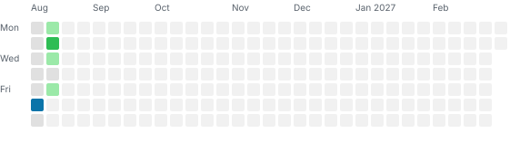

# Jeff Brozena, Ph.D. candidate in human-computer interaction

**I'm a digital health researcher exploring how fintech might help people living with mental illness, specifically bipolar disorder.** 

## The Problem

The American Psychiatric Association (APA) considers “engaging in unrestrained buying sprees or foolish business investments” as part of the diagnostic criteria for bipolar disorder, a chronic, episodic and serious mental illness. The APA considers this to have “a high potential for painful consequences."

For those impacted by this illness – including families, friends, and caregivers – these painful consequences are often quite material and last far longer than symptomatic periods. For example, in a [population-scale study](https://doi.org/10.1001/jamapsychiatry.2023.1179) analyzing the credit histories and health records of 46,167 individuals, those with bipolar disorder type I were shown to be at a **50% greater likelihood** of declaring bankruptcy than the healthy population.

## My Approach

I take a quant UX approach to create [usable evidence](https://pubmed.ncbi.nlm.nih.gov/30272059/) in order to inform digital financial health intervention design.

I'm working to understand how fintech-equipped interfaces might support the financial lives of people living with this condition. For example, what would _financial_ advance care planning look like for people who wanted it? How might novel digital interventions incorporate open banking data to support those plans? How do certain adverse clinical and financial life events commonly experienced by this population influence how comfortable people feel about involving trusted others in financial interventions?

I've collaborated with clinicians, digital health researchers, and people with lived experience to understand what is (and what's not!) feasible, acceptable, and possible if we involve financial data into clinically-meaningful contexts.

## Tools

Python, R, `lme4` for multilevel modeling, [`marginaleffects`](https://marginaleffects.com/) for posthoc analysis, [`altair`](https://github.com/vega/altair) for visualization, [`hmmTMB`](https://github.com/TheoMichelot/hmmTMB) for hidden Markov models in a multilevel framework. [Sawtooth Software](https://sawtoothsoftware.com/) (who kindly [awarded me a grant](https://sawtoothsoftware.com/academics/grants/grant-recipients/jeff-brozena)) for survey deployment. At home in Linux/Unix environments.

## Selected Publications

[**The Currency of Mood: Assessing Acceptance and Privacy Preferences of Third-party Financial Data Sharing in Bipolar Disorder**](https://doi.org/10.31234/osf.io/syrwu_v2) · First author · Under review, 2026

> A factorial vignette survey (N=500) to examine level of comfort with hypothetical scenarios involving third-party financial interventions during symptomatic and euthymic periods.

[**Mapping Financial Behavior in Bipolar Disorder: Development of a Dataset Linking Spending Habits to Mood Fluctuations**](https://brozena.net/assets/hershey.pdf) ·  First author · Accepted, Conference of the International Society for Bipolar Disorders, 2026

> Clinical assessment of financial behavior is often limited to self-report. This study (N=50) used open banking technologies to collect 24 months of transaction data and self-report mood logs from individuals with BD.

**Evidence-based Digital Design: Utilizing MaxDiff Findings to Guide the Development of Financial Interventions in Bipolar Disorder** · First author · Accepted, Conference of the International Society for Bipolar Disorders, 2026

> A MaxDiff survey deployed to 150 individuals with BD in order to rank 6 digital health intervention features intended to help support financial stability in this population. The MaxDiff design had not been used in the field of mental health before.

**Eight Years of Autonomic Monitoring: An N-of-1 Longitudinal Study of Wearable-derived HRV Anomalies and Self-reported Mood Logs** · First author · Accepted, Conference of the International Society for Bipolar Disorders, 2026

> An intensive N-of-1 analysis examining how wearable-derived nocturnal physiological anomalies and multidimensional mood states interact over an uninterrupted eight-year period.

<!-- WRITING-STATS:START -->
## Writing Stats

**Aug–Feb 2027, through 2026-08-12:** 1,773 net words  
**Average:** 148 net words/day (355 on 5 active days)  
**Goal met:** 1/12 days at ≥850 words

<!-- WRITING-STATS:END -->
